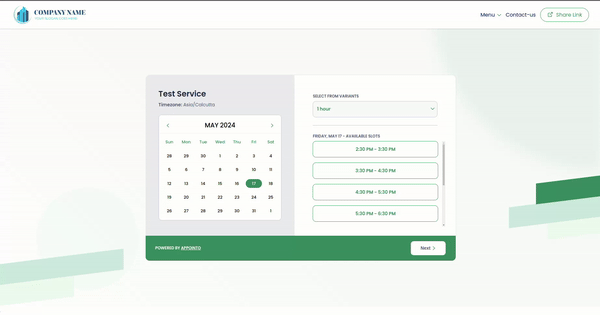

# Appointo Assignment

This README guides you on setting up and running the Appointo application from this Git repository.

## Prerequisites
**Node.js (version 14 or later)**: Download and install Node.js from the official website (https://nodejs.org/en).
npm (Node Package Manager): Node.js typically comes bundled with npm.

 Verify its installation by running npm -v in your terminal.
Installation
Clone the Repository:

## Bash

>`git clone git@github.com:AjithBillava/appointo.git`

>`cd your-repo-name`

## Install Dependencies:

Run the following command in your terminal to install the project's dependencies:

> `npm install`

## Running the Development Server
Start the development server to launch the application in hot-reload mode:
>`npm run dev`

This will typically open your default browser at  http://localhost:5173/ 

## [Demo](https://appointo.vercel.app/)

## Core Features
- select the date and timeslots
- navigate through differnet months
- click on next to book appointment
- click on share link to copy the booking link
